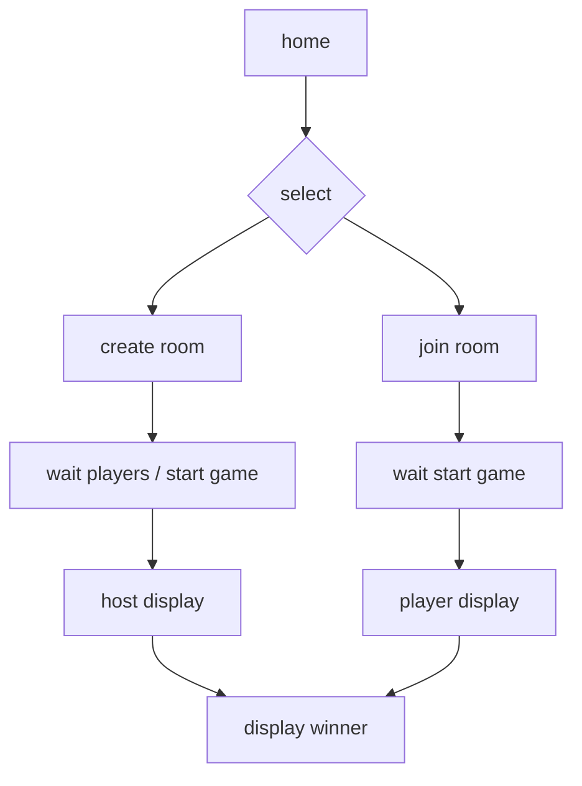

## Hi there! this my new project
Welcome to the Bingo App Deployment project! This project demonstrates how to deploy a Bingo application using modern DevOps tools and practices, following a DevSecOps approach.

## 🛠️ **Tools & Services Used**

| **Category**       | **Tools**                                                                                                                                                                                                 |
|---------------------|-----------------------------------------------------------------------------------------------------------------------------------------------------------------------------------------------------------|
| **Version Control** |                                                                                                        |
| **CI/CD**           |                                                                                                     |
| **Code Quality**    |                                                                                               |
| **Containerization**|                                                                                                        |
| **Orchestration**   |                                                                                           |
| **Monitoring**      |   |
| **Security**        |           |

---
## 🚦 **Project Stages**

### **Phase 1: Deployment to Docker Container**
- Containerize the application using Docker.
- Build and push Docker images to a container registry.
- Run the application in a Docker container.

### **Phase 2: Deployment to EKS Cluster with Monitoring**
- Deploy the application to an **Amazon EKS (Elastic Kubernetes Service)** cluster.
- Set up **Prometheus** and **Grafana** for monitoring and visualization.
- Implement **Trivy** for vulnerability scanning and **OWASP** for security best practices.

---

## 📂 **Code Repository**
Explore the code and contribute to the project:  
[](https://github.com/Aseemakram19/bingo1.git)

---
## 📹 **Project Video**
Watch the step-by-step deployment process:  
[](https://www.youtube.com/watch?v=HeGnExuCVmQ&t=616s)

---
## 🚀 **Other DevOps Projects**

| **Project**                                | **Video Link**                                                                                   |
|--------------------------------------------|--------------------------------------------------------------------------------------------------|
| **JAVA APPLICATION DEPLOYMENT Project**                     | [](https://www.youtube.com/watch?v=R98DHKqAEos) |

## 🤝 **Connect with Me**

Let's connect and discuss DevOps!  

[](https://www.linkedin.com/in/mohammed-aseem-akram/)  

The objective of this project was to learn how to use web sockets and how to create a multiplayer game. It was created using Next.js, React and Sockets.io. You can check it out  for the English version. Feel free to modify as you wish.

If you want the logic of the game bingo, go to utils → bingo.js.


## Getting Started

Install node.js 16  version  v16.20.2 combatiable with our application
        npm 8.19.4  version 
First, run the development server:

Follow this sequence to test out app :
1. cd bingo1
2. npm install
3. npm run dev

to run in background
nohup npm run dev &

Explaination below:

cd bingo1: Change directory to "bingo1" to navigate into the project's root directory.

npm install: Install project dependencies using npm, ensuring required packages are downloaded and configured.

npm run dev: Run the development script, typically used to start a development server or execute other development-related tasks.

nohup npm run dev &: Run the "npm run dev" command in the background using nohup, allowing it to continue running even after the terminal is closed.


```
Docker Container application 

docker build -t imagename rootdir


docker build -t bingo .

docker run -p 3000:3000 -d --name bingo your-image-name


docker run -p 3000:3000 -d --name bingoapp bingo


# Build and start the Docker container
docker-compose up -d

To stop the containers, you can use the following command:
# Stop the Docker containers

docker-compose down

# Restart the Docker after permissions Granted

sudo usermod -aG docker ubuntu

sudo usermod -aG jenkins $USER

sudo systemctl restart docker

docker-compose build

Open [http://localhost:3000](http://localhost:3000) with your browser to see the result.

You can start editing the page by modifying `pages/index.js`. The page auto-updates as you edit the file.

## Example

You can create a room where multiplayers can join to participate:


Changes will reflect on all participants' screens in the room:


## FlowChart


